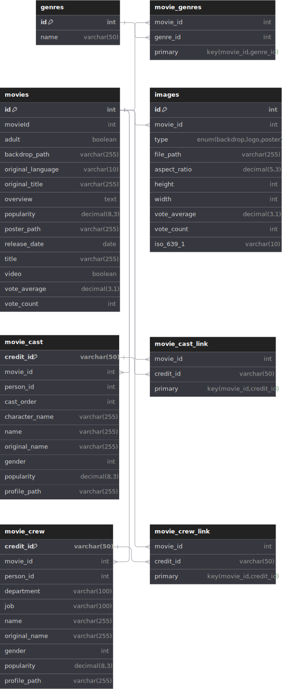

# Python-MySQL Project with The Movie Database API

This project demonstrates how to integrate Python with a MySQL database to interact with [The Movie Database (TMDb) API](https://developer.themoviedb.org/docs/getting-started). Follow the steps below to set up the project, fetch data from the API, and seed your database.

## API Endpoints

### 1. Fetch Movie Details

Use the following `curl` command to retrieve details of a movie (movie id: 11):

```bash
curl --request GET \
     --url 'https://api.themoviedb.org/3/movie/11' \
     --header 'Authorization: Bearer {{bearer}}'
```

> Replace `{{bearer}}` with your actual bearer token.

### 2. Fetch Movie Genres

Access the list of movie genres:

```
https://api.themoviedb.org/3/genre/movie/list
```

### 3. Image URLs

- **Sample Image URL:**

  ```
  https://image.tmdb.org/t/p/w500/pa2PkUAVT44ilJD7zLHeVNymQ02.jpg
  ```

- **Template for Image URLs:**

  ```
  https://image.tmdb.org/t/p/{size}/{image_path}
  ```

## Project Setup and Steps

1. **Obtain an API Key:**

   - Get your API key and Bearer token from [TMDb Developer Site](https://developer.themoviedb.org/docs/getting-started).

2. **Database Setup:**

   - Create a MySQL database.
   - Design and implement the necessary schemas.

3. **MySQL Connection:**

   - Set up a connection to your MySQL database.

4. **Python Integration:**

   - Establish a connection to the MySQL database from Python.
   - Implement Python logic to:
     - **Build Schemas:** Define and create the necessary tables.
     - **Fetch Data:** Retrieve data from TMDb using the API endpoints.
     - **Map Data:** Convert the API data into the corresponding table data structure.
     - **Seed the Database:** Populate your database with the fetched data.

# Python-MySQL Project with The Movie Database API



This project demonstrates how to integrate Python with a MySQL database to interact with [The Movie Database (TMDb) API](https://developer.themoviedb.org/docs/getting-started). Follow the steps below to set up the project, fetch data from the API, and seed your database.